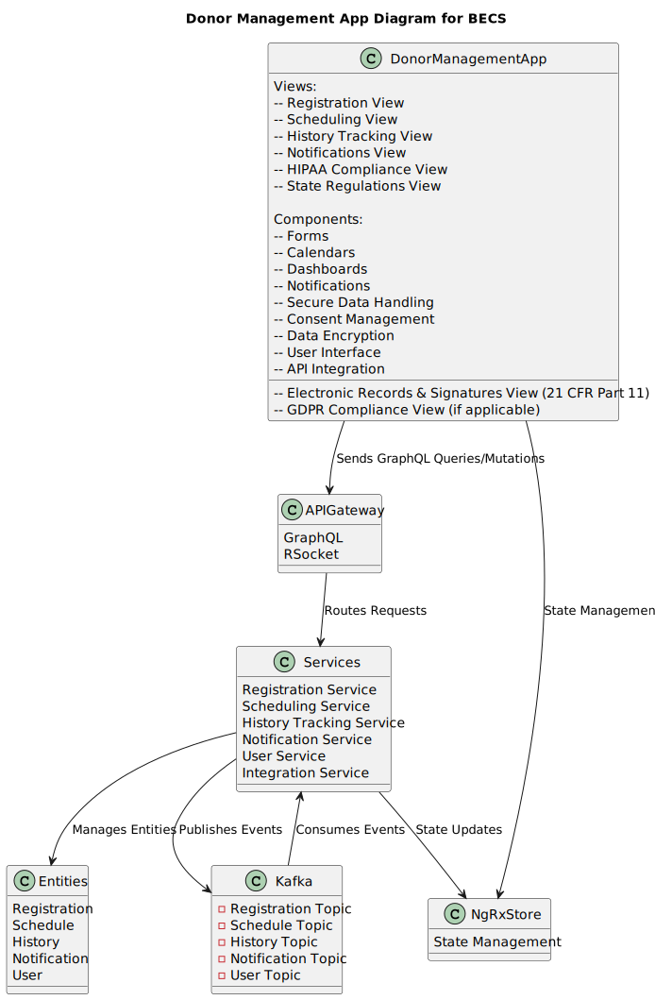
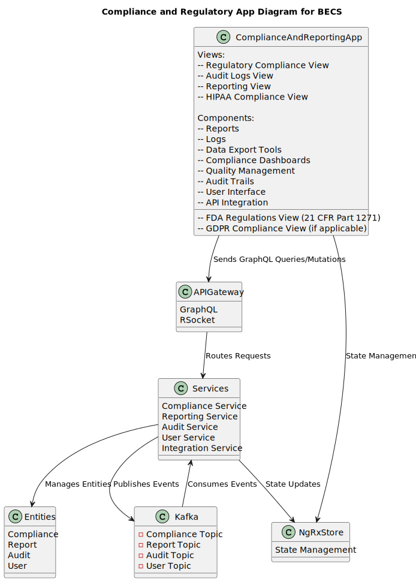
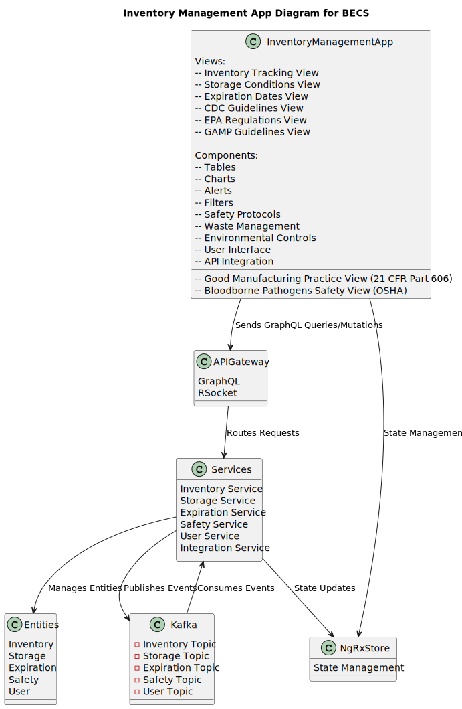
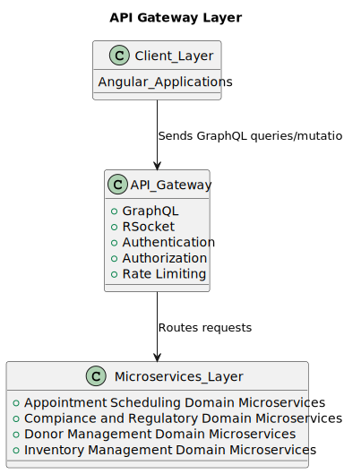

# High-Level Architectural Overview

This document provides a high-level overview of the architectural design for our next-generation Blood Establishment Computer System (BECS) platform. The architecture is designed to be scalable, secure, and aligned with our strategic goals.

## Architectural Diagram

## Client Layer

### Angular Applications

The client layer consists of Angular applications that interact with the system. These applications provide the user interface and handle user interactions.

Each Angular application is designed to be modular and reusable, ensuring that components can be easily maintained and updated. The client layer includes various features such as:

- Appointment Scheduling System: Manages scheduling, reminders, and cancellations of appointments.
- Donor Management System: Handles registration, history tracking, and notifications for donors.
- Inventory Management System: Oversees tracking of blood units, storage conditions, and expiration dates.
- Compliance and Reporting System: Ensures regulatory compliance, maintains audit logs, and generates reports.

Additionally, the client layer is responsible for rendering dynamic content, validating user inputs, and ensuring a seamless user experience across different devices and browsers.

### Appointment Scheduling Angular Application System Architecture

The Appointment Scheduling System is designed to manage the scheduling, reminders, and cancellations of appointments. Below is a detailed architectural diagram of the system:

#### Key Components

- **Views**: The system includes various views such as Scheduling View, Reminders View, Cancellations View, HIPAA Compliance View, Integration with Donor Management View, Real-time Availability View, Rescheduling View, and Calendar Integration View.
- **Components**: The core components include Calendars, Notifications, Forms, Secure Data Handling, Consent Management, Data Encryption, User Interface, and API Integration.
- **APIGateway**: The API Gateway supports GraphQL and RSocket for efficient communication and routes requests to the appropriate services.
- **Services**: The system is composed of several microservices including Appointment Service, Notification Service, User Service, Calendar Service, and Integration Service.
- **NgRxStore**: This is used for state management within the Angular application.
- **Entities**: The main entities managed by the system are Appointment, Notification, User, and Calendar.
- **Kafka**: Kafka is used for event streaming, with topics for Appointment, Notification, User, and Calendar.

#### Data Flow

1. **Client Interaction**: Users interact with the Appointment Scheduling App through various views.
2. **API Gateway**: The app sends GraphQL queries/mutations to the API Gateway.
3. **Service Routing**: The API Gateway routes these requests to the appropriate microservices.
4. **State Management**: The Appointment Scheduling App and services interact with NgRxStore for state management.
5. **Entity Management**: Services manage the entities and perform necessary operations.
6. **Event Streaming**: Services publish events to Kafka topics, and also consume events from these topics for asynchronous communication.

This architecture ensures a modular, scalable, and efficient system for managing appointments within the BECS platform.

### Donor Management Angular Application System Architecture

The Donor Management System is designed to handle registration, history tracking, and notifications for donors. Below is a detailed architectural diagram of the system:

#### Key Components

- **Views**: The system includes various views such as Registration View, Scheduling View, History Tracking View, Notifications View, Electronic Records & Signatures View (21 CFR Part 11), HIPAA Compliance View, NIH Guidelines View, GDPR Compliance View (if applicable), and State Regulations View.
- **Components**: The core components include Forms, Calendars, Dashboards, Notifications, Secure Data Handling, Consent Management, Data Encryption, User Interface, and API Integration.
- **APIGateway**: The API Gateway supports GraphQL and RSocket for efficient communication and routes requests to the appropriate services.
- **Services**: The system is composed of several microservices including Registration Service, Scheduling Service, History Tracking Service, Notification Service, User Service, and Integration Service.
- **NgRxStore**: This is used for state management within the Angular application.
- **Entities**: The main entities managed by the system are Registration, Schedule, History, Notification, and User.
- **Kafka**: Kafka is used for event streaming, with topics for Registration, Schedule, History, Notification, and User.

#### Data Flow

1. **Client Interaction**: Users interact with the Donor Management App through various views.
2. **API Gateway**: The app sends GraphQL queries/mutations to the API Gateway.
3. **Service Routing**: The API Gateway routes these requests to the appropriate microservices.
4. **State Management**: The Donor Management App and services interact with NgRxStore for state management.
5. **Entity Management**: Services manage the entities and perform necessary operations.
6. **Event Streaming**: Services publish events to Kafka topics, and also consume events from these topics for asynchronous communication.

This architecture ensures a modular, scalable, and efficient system for managing donor-related activities within the BECS platform.

### Compliance and Regulatory Angular Application System Architecture

The Compliance and Regulatory System is designed to handle regulatory compliance tracking, audit logs, and reporting. Below is a detailed architectural diagram of the system:

#### Key Components

- **Views**: The system includes various views such as Regulatory Compliance View, Audit Logs View, Reporting View, FDA Regulations View (21 CFR Part 1271), HIPAA Compliance View, and GDPR Compliance View (if applicable).
- **Components**: The core components include Reports, Logs, Data Export Tools, Compliance Dashboards, Quality Management, Audit Trails, User Interface, and API Integration.
- **APIGateway**: The API Gateway supports GraphQL and RSocket for efficient communication and routes requests to the appropriate services.
- **Services**: The system is composed of several microservices including Compliance Service, Reporting Service, Audit Service, User Service, and Integration Service.
- **NgRxStore**: This is used for state management within the Angular application.
- **Entities**: The main entities managed by the system are Compliance, Report, Audit, and User.
- **Kafka**: Kafka is used for event streaming, with topics for Compliance, Report, Audit, and User.

#### Data Flow

1. **Client Interaction**: Users interact with the Compliance and Regulatory App through various views.
2. **API Gateway**: The app sends GraphQL queries/mutations to the API Gateway.
3. **Service Routing**: The API Gateway routes these requests to the appropriate microservices.
4. **State Management**: The Compliance and Regulatory App and services interact with NgRxStore for state management.
5. **Entity Management**: Services manage the entities and perform necessary operations.
6. **Event Streaming**: Services publish events to Kafka topics, and also consume events from these topics for asynchronous communication.

This architecture ensures a modular, scalable, and efficient system for managing compliance and regulatory activities within the BECS platform.

### Inventory Management Angular Application System Architecture

The Inventory Management System is designed to handle inventory tracking, storage conditions, and expiration dates. Below is a detailed architectural diagram of the system:

#### Key Components

- **Views**: The system includes various views such as Inventory Tracking View, Storage Conditions View, Expiration Dates View, Good Manufacturing Practice View (21 CFR Part 606), Bloodborne Pathogens Safety View (OSHA), CDC Guidelines View, EPA Regulations View, and GAMP Guidelines View.
- **Components**: The core components include Tables, Charts, Alerts, Filters, Safety Protocols, Waste Management, Environmental Controls, User Interface, and API Integration.
- **APIGateway**: The API Gateway supports GraphQL and RSocket for efficient communication and routes requests to the appropriate services.
- **Services**: The system is composed of several microservices including Inventory Service, Storage Service, Expiration Service, Safety Service, User Service, and Integration Service.
- **NgRxStore**: This is used for state management within the Angular application.
- **Entities**: The main entities managed by the system are Inventory, Storage, Expiration, Safety, and User.
- **Kafka**: Kafka is used for event streaming, with topics for Inventory, Storage, Expiration, Safety, and User.

#### Data Flow

1. **Client Interaction**: Users interact with the Inventory Management App through various views.
2. **API Gateway**: The app sends GraphQL queries/mutations to the API Gateway.
3. **Service Routing**: The API Gateway routes these requests to the appropriate microservices.
4. **State Management**: The Inventory Management App and services interact with NgRxStore for state management.
5. **Entity Management**: Services manage the entities and perform necessary operations.
6. **Event Streaming**: Services publish events to Kafka topics, and also consume events from these topics for asynchronous communication.

This architecture ensures a modular, scalable, and efficient system for managing inventory-related activities within the BECS platform.

## API Gateway Layer

### API Gateway Layer in the Context of BECS

The API Gateway Layer is a crucial component in the Blood Establishment Computer System (BECS) architecture. It acts as an intermediary between the client applications and the microservices, ensuring efficient and secure communication. Below is a detailed explanation of the API Gateway Layer:

- **GraphQL and RSocket**: The API Gateway supports GraphQL for flexible and efficient querying of data, and RSocket for real-time, low-latency communication. This combination ensures that the client applications can interact with the backend services in an optimal manner.
- **Authentication and Authorization**: The API Gateway handles authentication and authorization, ensuring that only authorized users can access the system. This is critical for maintaining the security and integrity of the BECS platform.
- **Rate Limiting**: To protect the backend services from being overwhelmed by too many requests, the API Gateway implements rate limiting. This ensures that the system remains responsive and available even under high load conditions.
- **Routing Requests**: The primary function of the API Gateway is to route incoming requests from the client applications to the appropriate microservices. This decouples the client applications from the backend services, allowing for greater flexibility and scalability.
- **Integration with Microservices**: The API Gateway seamlessly integrates with the various microservices that make up the BECS platform. This includes microservices for appointment scheduling, compliance and regulatory management, donor management, and inventory management.
- **Security and Compliance**: The API Gateway ensures that all communication between the client applications and the backend services is secure. This includes data encryption, access controls, and secure configurations, ensuring that the system meets all relevant security standards and regulations.
- **Scalability and Performance**: By offloading tasks such as authentication, authorization, and rate limiting to the API Gateway, the backend services can focus on their core business logic. This improves the overall scalability and performance of the BECS platform.

In summary, the API Gateway Layer is a vital component of the BECS architecture, providing secure, efficient, and scalable communication between the client applications and the backend microservices. It ensures that the system meets the necessary security and compliance requirements while maintaining high performance and availability.

### Microservices Layer
This layer contains the microservices that implement the core business logic. It also includes event streaming using Kafka to handle asynchronous communication between services.

### Containerization
Microservices are deployed as containers using Docker. Kubernetes is used to manage and orchestrate these containers, ensuring high availability and scalability.

### Cloud Infrastructure
The system runs on AWS cloud services, including EC2, S3, RDS, and Lambda. Infrastructure as Code (IaC) tools like Terraform and AWS CloudFormation are used to automate the deployment and management of cloud resources.

### CI/CD Pipeline
The CI/CD pipeline, implemented using GitLab CI/CD, automates the build, test, and deployment processes, ensuring rapid and reliable delivery of software updates.

### Security & Compliance
Security and compliance are ensured through data encryption, access controls, and secure configurations. This layer ensures that the system meets all relevant security standards and regulations.

### Monitoring & Optimization
Monitoring tools are used to track the performance and health of the system. Performance optimization techniques are applied to ensure the system runs efficiently and can handle the expected load.

