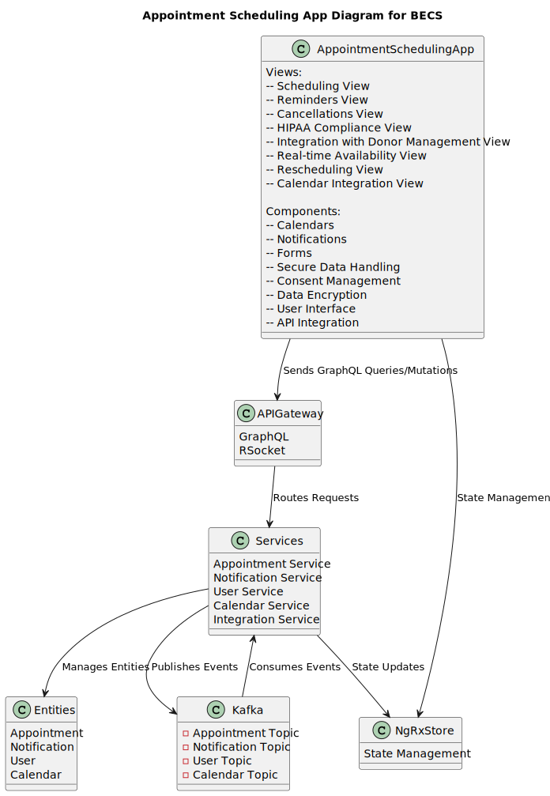
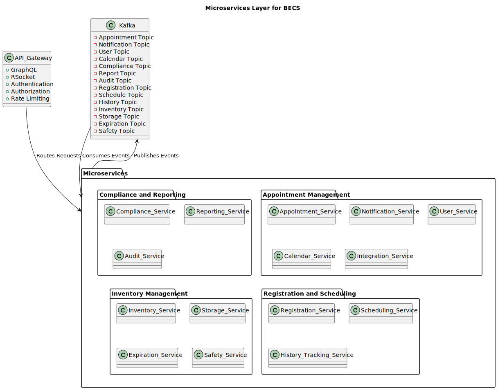
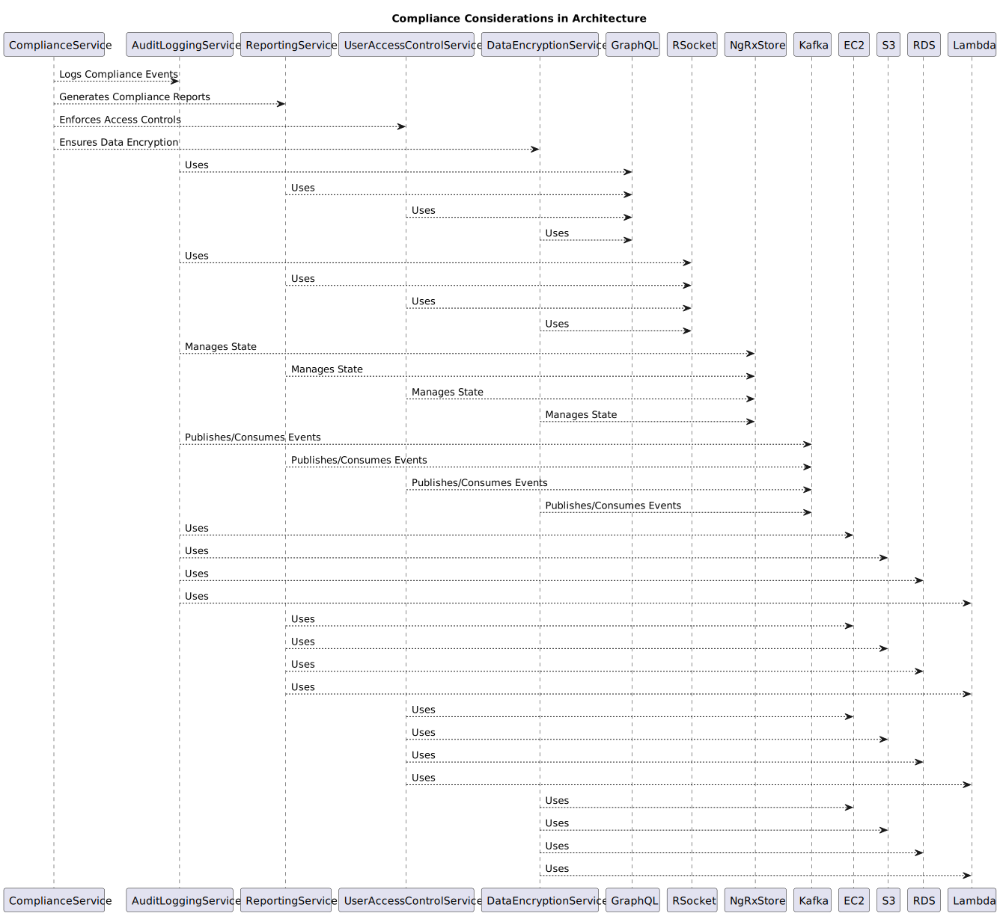

# High-Level Architectural Overview

This document provides a high-level overview of the architectural design for our next-generation Blood Establishment Computer System (BECS) platform. The architecture is designed to be scalable, secure, and aligned with our strategic goals.

## Architectural Diagram

## Client Layer

### Angular Applications

The client layer consists of Angular applications that interact with the system. These applications provide the user interface and handle user interactions.

Each Angular application is designed to be modular and reusable, ensuring that components can be easily maintained and updated. The client layer includes various features such as:

- Appointment Scheduling System: Manages scheduling, reminders, and cancellations of appointments.
- Donor Management System: Handles registration, history tracking, and notifications for donors.
- Inventory Management System: Oversees tracking of blood units, storage conditions, and expiration dates.
- Compliance and Reporting System: Ensures regulatory compliance, maintains audit logs, and generates reports.

Additionally, the client layer is responsible for rendering dynamic content, validating user inputs, and ensuring a seamless user experience across different devices and browsers.

#### Appointment Scheduling Angular Application System Architecture

The Appointment Scheduling System is designed to manage the scheduling, reminders, and cancellations of appointments. Below is a detailed architectural diagram of the system:

##### Key Components

- **Views**: The system includes various views such as Scheduling View, Reminders View, Cancellations View, HIPAA Compliance View, Integration with Donor Management View, Real-time Availability View, Rescheduling View, and Calendar Integration View.
- **Components**: The core components include Calendars, Notifications, Forms, Secure Data Handling, Consent Management, Data Encryption, User Interface, and API Integration.
- **APIGateway**: The API Gateway supports GraphQL and RSocket for efficient communication and routes requests to the appropriate services.
- **Services**: The system is composed of several microservices including Appointment Service, Notification Service, User Service, Calendar Service, and Integration Service.
- **NgRxStore**: This is used for state management within the Angular application.
- **Entities**: The main entities managed by the system are Appointment, Notification, User, and Calendar.
- **Kafka**: Kafka is used for event streaming, with topics for Appointment, Notification, User, and Calendar.

##### Data Flow

1. **Client Interaction**: Users interact with the Appointment Scheduling App through various views.
2. **API Gateway**: The app sends GraphQL queries/mutations to the API Gateway.
3. **Service Routing**: The API Gateway routes these requests to the appropriate microservices.
4. **State Management**: The Appointment Scheduling App and services interact with NgRxStore for state management.
5. **Entity Management**: Services manage the entities and perform necessary operations.
6. **Event Streaming**: Services publish events to Kafka topics, and also consume events from these topics for asynchronous communication.

This architecture ensures a modular, scalable, and efficient system for managing appointments within the BECS platform.

#### Donor Management Angular Application System Architecture

The Donor Management System is designed to handle registration, history tracking, and notifications for donors. Below is a detailed architectural diagram of the system:

##### Key Components

- **Views**: The system includes various views such as Registration View, Scheduling View, History Tracking View, Notifications View, Electronic Records & Signatures View (21 CFR Part 11), HIPAA Compliance View, NIH Guidelines View, GDPR Compliance View (if applicable), and State Regulations View.
- **Components**: The core components include Forms, Calendars, Dashboards, Notifications, Secure Data Handling, Consent Management, Data Encryption, User Interface, and API Integration.
- **APIGateway**: The API Gateway supports GraphQL and RSocket for efficient communication and routes requests to the appropriate services.
- **Services**: The system is composed of several microservices including Registration Service, Scheduling Service, History Tracking Service, Notification Service, User Service, and Integration Service.
- **NgRxStore**: This is used for state management within the Angular application.
- **Entities**: The main entities managed by the system are Registration, Schedule, History, Notification, and User.
- **Kafka**: Kafka is used for event streaming, with topics for Registration, Schedule, History, Notification, and User.

##### Data Flow

1. **Client Interaction**: Users interact with the Donor Management App through various views.
2. **API Gateway**: The app sends GraphQL queries/mutations to the API Gateway.
3. **Service Routing**: The API Gateway routes these requests to the appropriate microservices.
4. **State Management**: The Donor Management App and services interact with NgRxStore for state management.
5. **Entity Management**: Services manage the entities and perform necessary operations.
6. **Event Streaming**: Services publish events to Kafka topics, and also consume events from these topics for asynchronous communication.

This architecture ensures a modular, scalable, and efficient system for managing donor-related activities within the BECS platform.

#### Compliance and Regulatory Angular Application System Architecture

The Compliance and Regulatory System is designed to handle regulatory compliance tracking, audit logs, and reporting. Below is a detailed architectural diagram of the system:

##### Key Components

- **Views**: The system includes various views such as Regulatory Compliance View, Audit Logs View, Reporting View, FDA Regulations View (21 CFR Part 1271), HIPAA Compliance View, and GDPR Compliance View (if applicable).
- **Components**: The core components include Reports, Logs, Data Export Tools, Compliance Dashboards, Quality Management, Audit Trails, User Interface, and API Integration.
- **APIGateway**: The API Gateway supports GraphQL and RSocket for efficient communication and routes requests to the appropriate services.
- **Services**: The system is composed of several microservices including Compliance Service, Reporting Service, Audit Service, User Service, and Integration Service.
- **NgRxStore**: This is used for state management within the Angular application.
- **Entities**: The main entities managed by the system are Compliance, Report, Audit, and User.
- **Kafka**: Kafka is used for event streaming, with topics for Compliance, Report, Audit, and User.

##### Data Flow

1. **Client Interaction**: Users interact with the Compliance and Regulatory App through various views.
2. **API Gateway**: The app sends GraphQL queries/mutations to the API Gateway.
3. **Service Routing**: The API Gateway routes these requests to the appropriate microservices.
4. **State Management**: The Compliance and Regulatory App and services interact with NgRxStore for state management.
5. **Entity Management**: Services manage the entities and perform necessary operations.
6. **Event Streaming**: Services publish events to Kafka topics, and also consume events from these topics for asynchronous communication.

This architecture ensures a modular, scalable, and efficient system for managing compliance and regulatory activities within the BECS platform.

#### Inventory Management Angular Application System Architecture Layer

The Inventory Management System is designed to handle inventory tracking, storage conditions, and expiration dates. Below is a detailed architectural diagram of the system:

##### Key Components

- **Views**: The system includes various views such as Inventory Tracking View, Storage Conditions View, Expiration Dates View, Good Manufacturing Practice View (21 CFR Part 606), Bloodborne Pathogens Safety View (OSHA), CDC Guidelines View, EPA Regulations View, and GAMP Guidelines View.
- **Components**: The core components include Tables, Charts, Alerts, Filters, Safety Protocols, Waste Management, Environmental Controls, User Interface, and API Integration.
- **APIGateway**: The API Gateway supports GraphQL and RSocket for efficient communication and routes requests to the appropriate services.
- **Services**: The system is composed of several microservices including Inventory Service, Storage Service, Expiration Service, Safety Service, User Service, and Integration Service.
- **NgRxStore**: This is used for state management within the Angular application.
- **Entities**: The main entities managed by the system are Inventory, Storage, Expiration, Safety, and User.
- **Kafka**: Kafka is used for event streaming, with topics for Inventory, Storage, Expiration, Safety, and User.

##### Data Flow

1. **Client Interaction**: Users interact with the Inventory Management App through various views.
2. **API Gateway**: The app sends GraphQL queries/mutations to the API Gateway.
3. **Service Routing**: The API Gateway routes these requests to the appropriate microservices.
4. **State Management**: The Inventory Management App and services interact with NgRxStore for state management.
5. **Entity Management**: Services manage the entities and perform necessary operations.
6. **Event Streaming**: Services publish events to Kafka topics, and also consume events from these topics for asynchronous communication.

This architecture ensures a modular, scalable, and efficient system for managing inventory-related activities within the BECS platform.

## API Gateway Layer

### API Gateway Layer in the Context of BECS

The API Gateway Layer is a crucial component in the Blood Establishment Computer System (BECS) architecture. It acts as an intermediary between the client applications and the microservices, ensuring efficient and secure communication. Below is a detailed explanation of the API Gateway Layer:

- **GraphQL and RSocket**: The API Gateway supports GraphQL for flexible and efficient querying of data, and RSocket for real-time, low-latency communication. This combination ensures that the client applications can interact with the backend services in an optimal manner.
- **Authentication and Authorization**: The API Gateway handles authentication and authorization, ensuring that only authorized users can access the system. This is critical for maintaining the security and integrity of the BECS platform.
- **Rate Limiting**: To protect the backend services from being overwhelmed by too many requests, the API Gateway implements rate limiting. This ensures that the system remains responsive and available even under high load conditions.
- **Routing Requests**: The primary function of the API Gateway is to route incoming requests from the client applications to the appropriate microservices. This decouples the client applications from the backend services, allowing for greater flexibility and scalability.
- **Integration with Microservices**: The API Gateway seamlessly integrates with the various microservices that make up the BECS platform. This includes microservices for appointment scheduling, compliance and regulatory management, donor management, and inventory management.
- **Security and Compliance**: The API Gateway ensures that all communication between the client applications and the backend services is secure. This includes data encryption, access controls, and secure configurations, ensuring that the system meets all relevant security standards and regulations.
- **Scalability and Performance**: By offloading tasks such as authentication, authorization, and rate limiting to the API Gateway, the backend services can focus on their core business logic. This improves the overall scalability and performance of the BECS platform.

In summary, the API Gateway Layer is a vital component of the BECS architecture, providing secure, efficient, and scalable communication between the client applications and the backend microservices. It ensures that the system meets the necessary security and compliance requirements while maintaining high performance and availability.

## Microservices Layer

### Microservices Layer in the Context of BECS

The Microservices Layer is a fundamental part of the Blood Establishment Computer System (BECS) architecture. It consists of various microservices that handle different domains and functionalities within the system. Below is a detailed explanation of the Microservices Layer:

- **API Gateway**: The API Gateway acts as an entry point to the microservices, handling GraphQL queries, RSocket communication, authentication, authorization, and rate limiting. It routes requests to the appropriate microservices.
- **Microservices**: The system is divided into several packages, each containing specific microservices:
  - **Appointment Management**: Includes Appointment Service, Notification Service, User Service, Calendar Service, and Integration Service.
  - **Compliance and Reporting**: Includes Compliance Service, Reporting Service, and Audit Service.
  - **Registration and Scheduling**: Includes Registration Service, Scheduling Service, and History Tracking Service.
  - **Inventory Management**: Includes Inventory Service, Storage Service, Expiration Service, and Safety Service.
- **Kafka**: Kafka is used for event streaming within the microservices layer. It has topics for various events such as Appointment, Notification, User, Calendar, Compliance, Report, Audit, Registration, Schedule, History, Inventory, Storage, Expiration, and Safety.

### Data Flow

1. **Request Routing**: The API Gateway routes incoming requests from the client applications to the appropriate microservices.
2. **Event Publishing**: Microservices publish events to Kafka topics for asynchronous communication.
3. **Event Consumption**: Microservices consume events from Kafka topics to perform necessary operations.

This architecture ensures a modular, scalable, and efficient system for managing various functionalities within the BECS platform. The use of microservices allows for independent development, deployment, and scaling of different parts of the system, enhancing overall flexibility and maintainability.

## Containerization Layer

### Containerization Layer in the Context of BECS

The Containerization Layer is a critical component of the Blood Establishment Computer System (BECS) architecture. It leverages containerization and orchestration technologies to ensure that the system is scalable, resilient, and easy to manage. Below is a detailed explanation of the Containerization Layer:

- **Docker**: Docker is used to containerize the microservices, encapsulating them along with their dependencies. This ensures consistency across different environments and simplifies the deployment process. Each microservice runs in its own container, providing isolation and resource control.
- **Kubernetes**: Kubernetes is employed for container orchestration, managing the deployment, scaling, and operation of the containerized microservices. It provides high availability and scalability, ensuring that the system can handle varying loads and recover from failures. Kubernetes also automates the distribution and scheduling of containers across the cluster.
- **AWS**: The containerized microservices and Kubernetes clusters are deployed on Amazon Web Services (AWS). AWS provides a robust and scalable infrastructure with services such as EC2 for compute, S3 for storage, RDS for relational databases, and Lambda for serverless functions. This cloud infrastructure supports the high availability and scalability requirements of the BECS platform.

### Data Flow

1. **Containerization**: Microservices are packaged into Docker containers, ensuring consistency and portability.
2. **Orchestration**: Kubernetes manages the deployment, scaling, and operation of the containers, providing high availability and efficient resource utilization.
3. **Cloud Deployment**: The containerized microservices and Kubernetes clusters are deployed on AWS, leveraging its scalable and resilient infrastructure.

This architecture ensures a modular, scalable, and efficient system for managing various functionalities within the BECS platform. The use of containerization and orchestration technologies enhances the flexibility, maintainability, and reliability of the system, making it well-suited to meet the demands of a modern, cloud-based application.

## Cloud Infrastructure Layer (IaC)

### Cloud Infrastructure Layer in the Context of BECS

The Cloud Infrastructure Layer is a foundational component of the Blood Establishment Computer System (BECS) architecture. It provides the necessary infrastructure and tools to support the deployment, management, and security of the system. Below is a detailed explanation of the Cloud Infrastructure Layer:

- **AWS**: Amazon Web Services (AWS) is the primary cloud provider for the BECS platform. It offers a range of services that are utilized within this layer:
  - **EC2**: Elastic Compute Cloud (EC2) provides scalable virtual servers for running applications.
  - **S3**: Simple Storage Service (S3) offers scalable object storage for data.
  - **RDS**: Relational Database Service (RDS) provides managed relational databases.
  - **Lambda**: AWS Lambda enables serverless computing, allowing code to run in response to events without provisioning or managing servers.
- **IaC Tools**: Infrastructure as Code (IaC) tools are used to automate the provisioning and management of cloud resources:
  - **Terraform**: An open-source tool for building, changing, and versioning infrastructure safely and efficiently.
  - **AWS CloudFormation**: A service that helps model and set up AWS resources using templates.
- **Security**: Security is a critical aspect of the Cloud Infrastructure Layer, ensuring that the system meets all relevant security standards and regulations:
  - **Data Encryption**: Protects data at rest and in transit.
  - **Access Controls**: Manages who has access to resources and what actions they can perform.
  - **Secure Configurations**: Ensures that all resources are configured securely to prevent unauthorized access and vulnerabilities.

### Data Flow

1. **Resource Provisioning**: IaC tools like Terraform and AWS CloudFormation are used to provision and manage cloud resources.
2. **Service Utilization**: Various AWS services (EC2, S3, RDS, Lambda) are utilized to support the deployment and operation of the BECS platform.
3. **Security Enforcement**: Security measures such as data encryption, access controls, and secure configurations are enforced to protect the system.

This architecture ensures a robust, scalable, and secure infrastructure for the BECS platform. The use of cloud services and IaC tools enhances the flexibility, maintainability, and reliability of the system, making it well-suited to meet the demands of a modern, cloud-based application.

### CI/CD Pipeline

### CI/CD Pipeline in the Context of BECS

The CI/CD (Continuous Integration/Continuous Deployment) Pipeline is a crucial component of the Blood Establishment Computer System (BECS) architecture. It automates the process of building, testing, and deploying the application, ensuring that new code changes are integrated smoothly and delivered to production efficiently. Below is a detailed explanation of the CI/CD Pipeline:

- **Source Code Repository (SCM)**: The source code is stored in a GitLab repository. Developers push their code changes to this repository, triggering the CI/CD pipeline.
- **CI/CD Pipeline (CICD)**: The pipeline consists of several stages:
  - **Build**: The application is compiled and built.
  - **Test**: Unit and integration tests are run to ensure the code is functioning correctly.
  - **Security Scan**: Security scans are performed using tools like Snyk to identify vulnerabilities.
  - **Package**: Docker images are created for the application.
  - **Deploy**: The application is deployed to the respective environments.
- **Environments (ENVS)**: The application is deployed to various environments in a sequential manner:
  - **Development (DEV)**: The development environment where continuous integration occurs. Developers push code to GitLab, triggering automated builds and tests.
  - **Testing (TEST)**: The testing environment where automated integration and system tests are performed.
  - **Staging (STAGE)**: The pre-production environment where performance and load testing are conducted.
  - **User Acceptance Testing (UAT)**: The environment where user acceptance testing is performed. Approval is required before deploying to production.
  - **Production (PROD)**: The production environment where the application is live. It ensures high availability, scalability, continuous monitoring, and alerting.

### Data Flow

1. **Source Code Management**: Developers push code changes to the GitLab repository.
2. **Build and Test**: The CI/CD pipeline automatically builds the application and runs tests to ensure code quality.
3. **Security Scan**: Security scans are performed to identify and address vulnerabilities.
4. **Packaging**: Docker images are created for consistent deployment across environments.
5. **Deployment**: The application is deployed to development, testing, staging, UAT, and production environments sequentially.

This architecture ensures a streamlined and automated process for integrating and deploying code changes, enhancing the reliability, security, and efficiency of the BECS platform. The use of CI/CD practices ensures that the system can adapt quickly to changes and deliver new features and updates in a controlled and predictable manner.

### Security & Compliance

#### Security Diagram

### Security in the Context of BECS

The Security and Compliance layer is a critical component of the BECS architecture, ensuring that all security measures and compliance requirements are met. Below is a detailed explanation of the Security and Compliance Layer:

- **Encryption Service**: This service is responsible for encrypting data to protect it both at rest and in transit. It uses the Key Management Service (KMS) to manage encryption keys.
- **Key Management Service (KMS)**: KMS is used to create, manage, and store cryptographic keys. It ensures that keys are rotated and managed securely.
- **Key Rotation Service**: This service manages the rotation of encryption keys to ensure that keys are regularly updated and old keys are retired securely.
- **Access Control Service**: This service manages access to resources, ensuring that only authorized users and services can access sensitive data and perform specific actions.
- **Audit Logging Service**: This service logs key usage and access events, providing an audit trail for security and compliance purposes.

The Security Services interact with various components of the BECS platform to enforce security measures:
- **GraphQL**: Used for querying and manipulating data, ensuring secure access to the data layer.
- **RSocket**: A protocol for asynchronous communication, ensuring secure data transmission.
- **NgRx Store**: Manages the state of the application, ensuring that state changes are secure and compliant.
- **Kafka**: A messaging system used for publishing and consuming events, ensuring secure and reliable event handling.
- **Cloud Services**: Various cloud services are used to support the security and compliance requirements of the platform.

This architecture ensures that all security measures are integrated into the BECS platform, providing a robust and secure environment for managing sensitive data and meeting compliance requirements. The use of encryption, key management, access controls, and audit logging ensures that the system is protected against unauthorized access and data breaches, while also providing the necessary audit trails for compliance purposes.

### Compliance Diagram

### Compliance in the Context of BECS

The Compliance Layer in the BECS architecture ensures that all compliance requirements are met and that the system adheres to regulatory standards. Below is a detailed explanation of the Compliance Layer:

- **Compliance Service**: This service is responsible for managing compliance-related activities within the system. It interacts with various other services to ensure compliance.
  - **Audit Logging Service**: Logs compliance events to provide an audit trail for regulatory purposes.
  - **Reporting Service**: Generates compliance reports to demonstrate adherence to regulatory standards.
  - **User Access Control Service**: Enforces access controls to ensure that only authorized users can access sensitive data.
  - **Data Encryption Service**: Ensures that data is encrypted both at rest and in transit to protect it from unauthorized access.

The Compliance Service interacts with various components of the BECS platform to enforce compliance measures:
- **GraphQL**: Used for querying and manipulating data, ensuring secure and compliant access to the data layer.
- **RSocket**: A protocol for asynchronous communication, ensuring secure and compliant data transmission.
- **NgRx Store**: Manages the state of the application, ensuring that state changes are secure and compliant.
- **Kafka**: A messaging system used for publishing and consuming events, ensuring secure and reliable event handling.

Additionally, the Compliance Service utilizes various cloud services to support compliance requirements:
- **EC2**: Used for compute resources.
- **S3**: Used for storage.
- **RDS**: Used for relational database services.
- **Lambda**: Used for serverless computing.

This architecture ensures that all compliance measures are integrated into the BECS platform, providing a robust and secure environment for managing sensitive data and meeting regulatory requirements. The use of audit logging, reporting, access controls, and data encryption ensures that the system is protected against unauthorized access and data breaches, while also providing the necessary audit trails for compliance purposes.

### Monitoring & Optimization

Monitoring tools are used to track the performance and health of the system. Performance optimization techniques are applied to ensure the system runs efficiently and can handle the expected load.

#### Monitoring Diagram

#### Monitoring in the Context of BECS

The Monitoring Layer in the BECS architecture is designed to ensure that the system's performance and health are continuously tracked and optimized. Below is a detailed explanation of the Monitoring Layer:

- **Data Collection**: This component is responsible for collecting various metrics, logging events, and monitoring the overall health of the system.
  - **Collect Metrics**: Gathers performance data from different parts of the system.
  - **Log Events**: Records significant events that occur within the system.
  - **Monitor Health**: Continuously checks the health status of the system components.

- **Data Aggregation**: This component aggregates the collected data, correlates metrics, and stores the data for further analysis.
  - **Aggregate Logs**: Combines logs from different sources for a comprehensive view.
  - **Correlate Metrics**: Links related metrics to provide meaningful insights.
  - **Store Data**: Saves the aggregated data for future reference and analysis.

- **Data Analysis**: This component analyzes the aggregated data to identify trends, detect anomalies, and generate alerts.
  - **Analyze Trends**: Examines data over time to identify patterns and trends.
  - **Detect Anomalies**: Identifies unusual behavior or outliers in the data.
  - **Generate Alerts**: Sends notifications when specific conditions or thresholds are met.

- **Visualization**: This component provides visual representations of the data through dashboards, reports, and real-time monitoring tools.
  - **Dashboards**: Interactive displays that provide an overview of the system's performance and health.
  - **Reports**: Detailed documents that summarize the collected and analyzed data.
  - **Real-time Monitoring**: Tools that allow for live tracking of the system's status.

**The components of the Monitoring Layer interact in a sequential manner:**
- **Data Collection** feeds into **Data Aggregation**.
- **Data Aggregation** feeds into **Data Analysis**.
- **Data Analysis** feeds into **Visualization**.

To implement and manage the Monitoring Layer, we would use the following tools and technologies:

- **Docker**: For containerizing the monitoring services, ensuring they are portable and can run consistently across different environments.
- **Kubernetes**: For orchestrating the deployment, scaling, and management of the containerized monitoring services, ensuring high availability and efficient resource utilization.
- **AWS Cloud Services**: Leveraging services such as EC2 for compute resources, S3 for storage, and RDS for relational database services to support the monitoring infrastructure.
- **Terraform or AWS CloudFormation**: For automating the deployment and management of the cloud infrastructure required for the Monitoring Layer.
- **CI/CD Pipelines (GitLab CI/CD)**: To automate the deployment and updates of the monitoring services, ensuring that changes are tested and deployed efficiently.
- **Prometheus and Grafana**: For collecting metrics, aggregating data, and visualizing the system's performance and health through dashboards and alerts.
- **ELK Stack (Elasticsearch, Logstash, Kibana)**: For logging, aggregating, and analyzing log data, providing insights into the system's behavior and health.

This architecture ensures that the BECS platform is continuously monitored, allowing for proactive identification and resolution of issues, performance optimization, and maintaining the overall health of the system.

#### Optimization Diagram

#### Optimization in the Context of BECS

The Optimization Layer in the BECS architecture is designed to ensure that the system is continuously improved through a structured process. Below is a detailed explanation of the Optimization Layer:

- **Monitoring & Analysis**: This component is responsible for collecting metrics, analyzing performance, and identifying bottlenecks in the system.
  - **Collect Metrics**: Gathers performance data from different parts of the system.
  - **Analyze Performance**: Evaluates the collected data to understand the system's performance.
  - **Identify Bottlenecks**: Detects areas where the system's performance is hindered.

- **Planning**: This component sets improvement goals, prioritizes actions, and develops an action plan to address the identified bottlenecks.
  - **Set Improvement Goals**: Defines objectives for enhancing the system's performance.
  - **Prioritize Actions**: Determines the order in which actions should be taken based on their impact and feasibility.
  - **Develop Action Plan**: Creates a detailed plan outlining the steps needed to achieve the improvement goals.

- **Implementation**: This component executes the action plan, deploys changes, and monitors the impact of those changes.
  - **Execute Action Plan**: Carries out the steps defined in the action plan.
  - **Deploy Changes**: Implements the changes in the system.
  - **Monitor Impact**: Observes the effects of the changes to ensure they achieve the desired improvements.

- **Review**: This component evaluates the results of the implemented changes, documents learnings, and adjusts strategies as needed.
  - **Evaluate Results**: Assesses the outcomes of the changes to determine their effectiveness.
  - **Document Learnings**: Records insights and lessons learned from the process.
  - **Adjust Strategies**: Modifies the approach based on the evaluation to continuously improve the system.

**The components of the Optimization Layer interact in a cyclical manner:**
- **Monitoring & Analysis** feeds into **Planning**.
- **Planning** feeds into **Implementation**.
- **Implementation** feeds into **Review**.
- **Review** feeds back into **Monitoring & Analysis**.

To implement and manage the Optimization Layer, we would use the following tools and technologies:

- **Docker**: For containerizing the optimization services, ensuring they are portable and can run consistently across different environments.
- **Kubernetes**: For orchestrating the deployment, scaling, and management of the containerized optimization services, ensuring high availability and efficient resource utilization.
- **AWS Cloud Services**: Leveraging services such as EC2 for compute resources, S3 for storage, and RDS for relational database services to support the optimization infrastructure.
- **Terraform or AWS CloudFormation**: For automating the deployment and management of the cloud infrastructure required for the Optimization Layer.
- **CI/CD Pipelines (GitLab CI/CD)**: To automate the deployment and updates of the optimization services, ensuring that changes are tested and deployed efficiently.
- **Prometheus and Grafana**: For collecting metrics, aggregating data, and visualizing the system's performance and health through dashboards and alerts.
- **ELK Stack (Elasticsearch, Logstash, Kibana)**: For logging, aggregating, and analyzing log data, providing insights into the system's behavior and health.

This architecture ensures that the BECS platform is continuously optimized, allowing for proactive identification and resolution of issues, performance enhancement, and maintaining the overall efficiency of the system.

### Design Considerations of the BECS Platform

The architecture of the Blood Establishment Computer System (BECS) platform is designed with several key considerations in mind. Here are some of the primary design considerations based on the provided documentation:

1. **Scalability**
   - **Microservices Architecture**: The use of microservices allows for independent scaling of different parts of the system. Each microservice can be scaled based on its specific load and performance requirements.
   - **Containerization and Orchestration**: Docker and Kubernetes are used to manage and scale the containerized microservices, ensuring high availability and efficient resource utilization.
   - **Cloud Infrastructure**: The deployment on AWS provides scalable infrastructure services such as EC2, S3, and RDS, which can be scaled up or down based on demand.

2. **Security**
   - **API Gateway**: Handles authentication, authorization, and rate limiting to protect backend services.
   - **Encryption**: Data is encrypted both at rest and in transit using services like AWS KMS.
   - **Access Controls**: Managed through an Access Control Service to ensure only authorized users can access sensitive data.
   - **Audit Logging**: Logs key usage and access events for security and compliance purposes.

3. **Compliance**
   - **Compliance Services**: Manage compliance-related activities, including audit logging, reporting, and enforcing access controls.
   - **Data Encryption**: Ensures data protection to meet regulatory requirements.
   - **Audit Trails**: Provide necessary audit trails for compliance purposes.

4. **Modularity**
   - **Microservices**: Each microservice handles a specific domain or functionality, allowing for independent development, deployment, and maintenance.
   - **Angular Applications**: The client layer consists of modular Angular applications, each designed to be reusable and maintainable.

5. **Performance**
   - **Event Streaming**: Kafka is used for event streaming, enabling efficient asynchronous communication between services.
   - **State Management**: NgRxStore is used for state management within Angular applications, ensuring efficient handling of application state.

6. **Maintainability**
   - **Infrastructure as Code (IaC)**: Tools like Terraform and AWS CloudFormation are used to automate the provisioning and management of cloud resources.
   - **CI/CD Pipeline**: Automates the process of building, testing, and deploying the application, ensuring smooth integration and delivery of code changes.

7. **Flexibility**
   - **GraphQL and RSocket**: The API Gateway supports GraphQL for flexible querying and RSocket for real-time communication.
   - **Cloud-Native Design**: Leveraging AWS services allows for easy adaptation to new requirements and technologies.

8. **Resilience**
   - **Kubernetes**: Ensures high availability and recovery from failures.
   - **AWS Services**: Provide a robust and resilient infrastructure.

9. **Monitoring and Optimization**
   - **Monitoring Tools**: Tools like Prometheus, Grafana, and the ELK stack are used to track performance and health.
   - **Optimization Processes**: Structured processes for identifying and resolving performance bottlenecks.

### Conclusion

The BECS platform's architecture is meticulously designed to address various critical aspects such as scalability, security, compliance, modularity, performance, maintainability, flexibility, resilience, and continuous monitoring and optimization. By leveraging modern technologies and best practices, the platform ensures high availability, robust security, regulatory compliance, and efficient performance. This comprehensive approach allows the BECS platform to proactively identify and resolve issues, optimize performance, and maintain the overall health and efficiency of the system, ultimately supporting the critical operations of blood establishments.

### Future Enhancements

To further improve the BECS platform, the following future enhancements are suggested:

1. **Advanced Machine Learning Integration**
   - **Predictive Analytics**: Implement machine learning models to predict potential issues before they occur, allowing for proactive maintenance and optimization.
   - **Personalized User Experience**: Use machine learning to provide personalized recommendations and insights to users based on their behavior and preferences.

2. **Enhanced Security Measures**
   - **Zero Trust Architecture**: Adopt a zero trust security model to ensure strict verification of every access request, regardless of its origin.
   - **Advanced Threat Detection**: Integrate advanced threat detection systems to identify and mitigate sophisticated cyber threats in real-time.

3. **Improved User Interface**
   - **User-Centric Design**: Continuously refine the user interface based on user feedback to enhance usability and accessibility.
   - **Responsive Design**: Ensure the platform is fully responsive and provides a seamless experience across all devices, including mobile and tablets.

6. **Enhanced Data Management**
   - **Data Lake Integration**: Integrate a data lake to store and manage large volumes of structured and unstructured data, enabling advanced analytics and insights.
   - **Data Governance**: Implement robust data governance practices to ensure data quality, security, and compliance.

By implementing these future enhancements, the BECS platform can continue to evolve and meet the growing needs of blood establishments, ensuring it remains at the forefront of technology and innovation in the healthcare sector.
