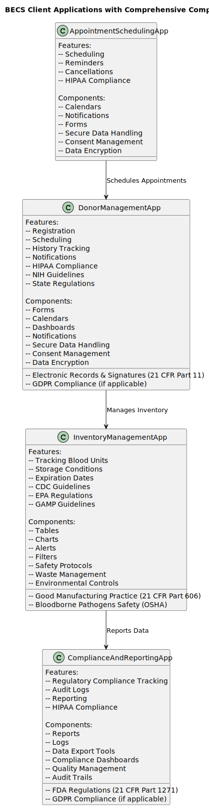

# High-Level Architectural Overview

This document provides a high-level overview of the architectural design for our next-generation Blood Establishment Computer System (BECS) platform. The architecture is designed to be scalable, secure, and aligned with our strategic goals.

## Architectural Diagram

Below is the high-level architectural diagram of the system:

## Key Components

### Client Layer
<table>
  <tr>
    <td></td>
    <td>
      
The client layer consists of Angular applications that interact with the system. These applications provide the user interface and handle user interactions.

      
Each Angular application is designed to be modular and reusable, ensuring that components can be easily maintained and updated. The client layer includes various features such as:

      <ul>
        <li>Registration: Allows users to sign up and create accounts.</li>
        <li>Scheduling: Enables users to book and manage appointments.</li>
        <li>History Tracking: Provides a detailed history of user interactions and activities.</li>
        <li>Notifications: Sends alerts and reminders to users about important events and updates.</li>
      </ul>
      
Additionally, the client layer is responsible for rendering dynamic content, validating user inputs, and ensuring a seamless user experience across different devices and browsers.

    </td>
  </tr>
</table>

### API Gateway
The API Gateway is responsible for routing requests from the client layer to the appropriate microservices. It supports GraphQL and RSocket for efficient communication.

### Microservices Layer
This layer contains the microservices that implement the core business logic. It also includes event streaming using Kafka to handle asynchronous communication between services.

### Containerization
Microservices are deployed as containers using Docker. Kubernetes is used to manage and orchestrate these containers, ensuring high availability and scalability.

### Cloud Infrastructure
The system runs on AWS cloud services, including EC2, S3, RDS, and Lambda. Infrastructure as Code (IaC) tools like Terraform and AWS CloudFormation are used to automate the deployment and management of cloud resources.

### CI/CD Pipeline
The CI/CD pipeline, implemented using GitLab CI/CD, automates the build, test, and deployment processes, ensuring rapid and reliable delivery of software updates.

### Security & Compliance
Security and compliance are ensured through data encryption, access controls, and secure configurations. This layer ensures that the system meets all relevant security standards and regulations.

### Monitoring & Optimization
Monitoring tools are used to track the performance and health of the system. Performance optimization techniques are applied to ensure the system runs efficiently and can handle the expected load.

